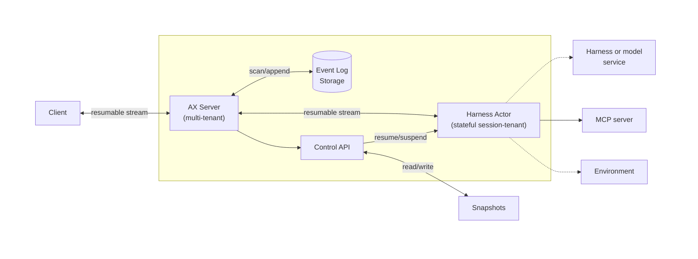

# Agent Executor (AX)

> [!WARNING]
> 🚧 **AX is in active early development.**
>
> We are actively refining our core, resumption protocols,
> and runtime specifications, which will introduce major breaking
> changes prior to a stable release.
>
> **Temporary Policy:** We are temporarily pausing the acceptance of external Pull Requests while we stabilize the core architecture. We warmly encourage you to open Issues for feedback and feature requests instead.
>
> We will announce this project
> widely soon. If you are interested in collaborating with us,
> please reach out to **ax-dev@google.com**!

AX, short for Agent Executor, is a distributed harness runtime.
It dynamically provisions isolated environments from suspendable/resumable
images to execute harnesses and agents.
AX is designed for reliability, with native support for recovery
and execution resumption, even in distributed setups.

## Features

- **Distributed Runtime**: Harnesses, skills, tools, and agents can execute in isolation
- **Resumption**: Automatic recovery from failures or interruptions
- **Built-in Harnesses**: Support for frontier harnesses and custom implementations
- **Auditing & Policy**: All user and agentic calls are coordinated by a common controller, easy to control and audit the overall execution and skill/tool/agent calls
- **Portability**: Runs anywhere, scales to small and large deployments
- **Customizability**: Agnostic of harness and model

Built-in consistency and resumability features:
- **Single-Writer Architecture**: Single controller ensures consistent state management
- **Event Log**: Durable execution state with automatic recovery
- **Advanced Resumption**: Support for compute-layer actor resumption on compatible platforms

## Demo

[](https://www.youtube.com/watch?v=L5Iw1IrZ6Nc)

Watch our demo to see AX works when deployed on [Agent Substrate](https://github.com/agent-substrate/substrate).

## Overview



As agents evolve from simple assistants to autonomous long running workers,
developers need a robust runtime to manage state, ensure reliability,
and audit execution. As we are moving away from monolithic agents towards
distributed harnesses where tools, skills and agents are deployed as
isolated actors, a distributed runtime with dynamically spawned isolated
workers becomes a necessity. AX provides the foundational layer to fill these gaps.

While compute-agnostic, AX is aiming to provide the best
experience on Kubernetes.

We expect every sophisticated agentic application will need the
capabilities provided by AX.
We are building this layer as a widely available foundation,
enabling developers to focus on building their applications rather
than infrastructure. We decided to build this project in public to
validate every design decision before a stable release is cut.
We highly encourage you to give us feedback.

## Installation

Install the ax CLI directly from the repository:

```bash
go install github.com/google/ax/cmd/ax@latest
```

### Verify Installation

Check that ax is installed correctly:

```bash
ax --help
```

You should see the ax CLI usage information.

### Kubernetes

AX is natively supported on
[Agent Substrate](https://github.com/agent-substrate/substrate)
on Kubernetes and it's the recommended deployment option for production
use. For more details on setup and configuration, see the
[deployment guide](./manifests/README.md).
Read more about [this new layer](https://cloud.google.com/blog/products/containers-kubernetes/bringing-you-agent-sandbox-on-gke-and-agent-substrate)
that provides higher density to agentic workloads on Kubernetes.

## Quick Start

### 1. Execute

The CLI provides an easy way to execute by using the
agents and built-in tools already linked into the AX binary.

```bash
# Using default ax.yaml
ax exec --input "Can you list me this directory?"

# Using exec with an AX server
ax exec --input "Can you list me this directory?" --server localhost:8494
```

Conversations can be continued any time:

```bash
ax exec \
  --conversation d85a4b4e-c53b-4c84-b879-f10d905bce40 \
  --input "Show me the contents of README.md"
```

If the client gets disconnected, pass the last sequence it saw to
replay the events it missed. This catches the client up; it does not
rewind the conversation.

In this example, we catch up a client from sequence number 12:

```bash
ax exec \
  --conversation d85a4b4e-c53b-4c84-b879-f10d905bce40 \
  --last-seq 12 \
  --resume
```

Instead of running the default harness, you can start executing
any registered harness:

```bash
ax exec \
  --harness antigravity \
  --input "Can you write me a simple HTTP server in Python?"
```

If anything goes wrong during the execution of an agent,
you can resume an incomplete execution in a conversation:
```bash
ax exec \
  --conversation edf98ef5-4bb1-4a9e-a091-3a77e03727e6 \
  --harness antigravity \
  --resume
```


## Usage

The `ax` command provides several subcommands:

### Execute

```bash
ax exec \
    [--input <text>] \
    [--conversation <id>] \
    [--harness <id>] \
    [--server <address>] \
    [--config <file>] \
    [--resume] \
    [--last-seq <number>]
```

Executes a new harness execution or automatically resumes an existing one. If the conversation ID already exists, the execution will be resumed from its last state.

Options:
- `--input`: Input message to send to agents (optional if `--resume` is set, otherwise required)
- `--conversation`: Conversation ID (optional, generates UUID if not provided, or resumes if exists)
- `--harness`: Harness ID to use (optional, defaults to the default harness)
- `--server`: gRPC controller server address (optional. If not provided, runs with a local built-in AX server)
- `--config`: Path to YAML configuration file (only used with a local built-in AX server, default: "ax.yaml")
- `--resume`: Resume a conversation without inputs (optional, mutually exclusive with `--input`)
- `--last-seq`: Last sequence number seen by the client to resume from (optional). The server replays any later events so the client can catch up after a disconnect.

**Examples:**

```bash
# Execute a new execution
ax exec --input "Hello agents!"

# Resume an existing execution with new input
ax exec --conversation a53d4db3-1165-4925-87da-be6c72bbdeb1 --input "Ok, now let's do something else..."

# Execute using server mode
ax exec --server localhost:8494 --input "Hello agents!"

# Execute using a custom agent
ax exec --harness coding --input "Hello coding agent, write me a cool Go program!"
```

### Serve

```bash
ax serve [--config <path>]
```

Starts the controller as a gRPC server using a YAML configuration file.

Options:
- `--config`: Path to YAML configuration file (default: "ax.yaml")

Example configuration file (`ax.yaml`):
```yaml
version: v1alpha

server:
  address: ":8494"

eventlog:
  sqlite:
    filename: "eventlog/log.sqlite"
```

Example:
```bash
# Start server with default config (ax.yaml)
ax serve

# Start server with custom config
ax serve --config my-config.yaml
```

### Authentication

The built-in Antigravity agent supports authentication using either Google AI Studio or Vertex AI:

```bash
# AI Studio API key based authentication.
export GEMINI_API_KEY="your-api-key"

# Vertex AI based authentication, ensure application
# default credentials are set up, gcloud auth application-default login.
export GOOGLE_CLOUD_PROJECT="your-project-id"
export GOOGLE_CLOUD_LOCATION="us-central1"
export GOOGLE_GENAI_USE_VERTEXAI=True
```

## Extensions

### Harnesses

AX provides built-in harnesses (e.g. Antigravity) but you can bring your
own harness implementation by implementing `HarnessService`. On supported
compute services (e.g. Agent Substrate), AX automatically runs the
harness in isolation with automatic resumption and suspension.

Traditional agents (e.g. tool use or workflow agents), or
language models can be implemented as harnesses.

### Skills

Built-in harnesses like Antigravity includes built-in support for
Agent Skills. See [Skills](examples/skills) for more.

### MCP Tools

Built-in harnesses like Antigravity provides support for discovering
and making calls to MCP tools when they are configured.

## What AX is NOT?
* A managed service. AX is self-hosted and not a managed service.
  We aim to make it easy for users to deploy and operate it on
  their Kubernetes clusters.
* An agentic framework. AX is agnostic of the framework used
  to build agents.
* A specific harness like a specific coding agent, e.g. Antigravity.
  AX provides the serving layer around harnesses and is agnostic of the
  harness implementation. Soon, we will allow users to bring their own
  harnesses.
* A model specific controller. AX is agnostic of the models used.

## Roadmap

Below is an overview of our upcoming features and planned changes:

1. Support for more frontier harnesses besides Antigravity
1. Support for BYOH (Bring Your Own Harness)
1. Support for tool call approvals from harnesses
1. Improvements to resumption protocols
1. Forking from event log and snapshots
1. Trajectory exposition
1. Better telemetry exposition
1. Integrations for policy, auditing, and more

## Contributing

Please refer to the [CONTRIBUTING.md](CONTRIBUTING.md) guide for instructions
on how to contribute to this project.

We are currently undergoing a significant architectural redesign, and external contributions are temporarily paused.
However, in the meantime, we warmly encourage you to file bugs and
send feature requests.

## History

Over the years, teams across Google built and operated several
distributed execution engines. As these systems evolved, certain
architectural patterns consistently stood the test of time.
The teams realized they were repeatedly solving similar
orchestration problems, prompting the push to extract these
lessons into common runtime layer.

While this common layer was taking shape, the AI landscape underwent
a massive shift. Applications were transitioning from
statless tool use agents to autonomous, long-running, self improving
agents that often need isolated resumable execution environments.
Also, from an efficiency standpoint, agentic workloads are inherently bursty.
An agent might compute intensively for a minute, then sit idle for
hours or days awaiting human approval. Keeping a stateful actor active
during these long idle periods is highly inefficient and cost-prohibitive
at scale.
Over the last 10 years, Kubernetes has become the standard for
large scale job orchestration, but it was fundamentally designed for
stateless microservices or predictable batch jobs --
not for suspending and resuming stateful, sandboxed agent actors.

Driven by these dual challenges, we decided to build a robust, common
agentic orchestrator designed specifically for the new compute
layers we are developing on Kubernetes. Our goal is to ease
the productionization of agents, allowing developers
and researchers to focus on building and evaluating their
applications rather than dealing with underlying infrastructure.

AX is developed and maintained by the team actively working on
Google's internal runtime. Although the two projects operate
at different layers today, we are applying our knowledge
and insights to AX in the public domain every day.

## Acknowledgements

We thank Google DeepMind for their earlier work in distributed harnesses which
heavily influenced AX.
We thank the Google Kubernetes Engine team for their deep contributions
regarding isolation, resumption and job scheduling.

## License

Apache 2.0
