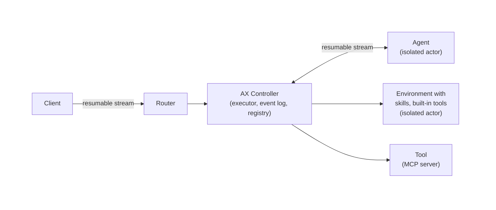

# Agent Executor (AX)

> [!WARNING]
> 🚧 **AX is in active early development.**
>
> We are actively refining our core, resumption protocols,
> and runtime specifications, which will introduce major breaking
> changes prior to a stable release.
>
> **Temporary Policy:** We are temporarily pausing the acceptance of external Pull Requests while we stabilize the core architecture. We warmly encourage you to open Issues for feedback and feature requests instead.
>
> We will announce this project
> widely soon. If you are interested in collaborating with us,
> please reach out to **ax-dev@google.com**!

AX, short for Agent eXecutor, is a distributed agent runtime. It provides a
runtime that coordinates agentic loops, manages executions with event logging,
and communicates with both local and remote actors.
AX is designed for reliability, with native support for recovery
and execution resumption, even in complex distributed setups.

## Features

- **Distributed Runtime**: Controller, skills, tools, and agents can execute in isolation
- **Resumption**: Automatic recovery from failures or interruptions
- **Skills, Tools, Agents**: Support for skill, tool, and agent selection and execution
- **Auditing & Policy**: All user and agentic calls are coordinated by a common controller, easy to control and audit the overall execution and skill/tool/agent calls
- **Portability**: Runs anywhere, scales to small and large deployments
- **Customizability**: Agnostic of harness and model

Built-in consistency and resumability features:
- **Single-Writer Architecture**: Single controller ensures consistent state management
- **Event Log**: Durable execution state with automatic recovery
- **Advanced Resumption**: Support for compute-layer actor resumption on compatible platforms

## Demo

[](https://www.youtube.com/watch?v=L5Iw1IrZ6Nc)

Watch our demo to see AX works when deployed on [Agent Substrate](https://github.com/agent-substrate/substrate).

## Overview



As agents evolve from simple assistants to autonomous long running workers,
developers need a robust runtime to manage state, ensure reliability,
and audit execution. As we are moving away from monolithic agents towards
distributed harnesses where tools, skills and agents are deployed as
isolated actors, a distributed runtime with dynamically spawned isolated
workers becomes a necessity. AX provides the foundational layer to fill these gaps.

While compute-agnostic, AX is aiming to provide the best
experience on Kubernetes.

We expect every sophisticated agentic application will need the capabilities provided by AX.
We are building this layer as a widely available foundation,
enabling developers to focus on building their applications rather than infrastructure.
We decided to build this project in public to validate every design decision before
a stable release is cut. We highly encourage you to give us feedback.

## Installation

Install the ax CLI directly from the repository:

```bash
go install github.com/google/ax/cmd/ax@latest
```

### Verify Installation

Check that ax is installed correctly:

```bash
ax --help
```

You should see the ax CLI usage information.

### Kubernetes

AX is natively supported on
[Agent Substrate](https://github.com/agent-substrate/substrate)
on Kubernetes and it's the recommended deployment option for production
use. For more details on setup and configuration, see the
[deployment guide](./manifests/README.md).

Read more about [this new layer](https://cloud.google.com/blog/products/containers-kubernetes/bringing-you-agent-sandbox-on-gke-and-agent-substrate)
that provides higher density to agentic workloads on Kubernetes.

## Quick Start

### 1. Execute

The CLI provides an easy way to execute by using the
agents and built-in tools already linked into the AX binary.

```bash
# Using default ax.yaml
ax exec --input "Can you list me this directory?"

# Using exec with an AX server
ax exec --input "Can you list me this directory?" --server localhost:8494
```

Conversations can be continued any time:

```bash
ax exec \
  --conversation d85a4b4e-c53b-4c84-b879-f10d905bce40 \
  --input "Show me the contents of README.md"
```

If the client gets disconnected, pass the last sequence it saw to
replay the events it missed. This catches the client up; it does not
rewind the conversation.

In this example, we catch up a client from sequence number 12:

```bash
ax exec \
  --conversation d85a4b4e-c53b-4c84-b879-f10d905bce40 \
  --last-seq 12 \
  --resume
```

Instead of running the default planning step, you can start executing
from any registered agent:

```bash
ax exec \
  --agent coding \
  --input "Can you write me a simple HTTP server in Python?"
```

If anything goes wrong during the execution of an agent,
you can resume an incomplete execution in a conversation:
```bash
ax exec \
  --conversation edf98ef5-4bb1-4a9e-a091-3a77e03727e6 \
  --agent "coding" \
  --resume
```

### 2. Execute with Custom Agents

Most developers want to build their own agents. AX allows running custom agents as remote
or sandbox agents. See [Custom Agents](#custom-agents) for a full list of supported agents.

This example demonstrates how the AX server executes remote agents
through the `AgentService.Connect` RPC.

**Terminal 1** - Start the remote agent server:
```bash
go run examples/remote_agent/main.go
```
The remote agent runs as a gRPC server implementing `AgentService` on port `:50051`.

**Terminal 2** - Start the AX controller server:
```bash
# Ensure the agent is registered as a remote agent in ax.yaml.
cat ax.yaml
# ...
registry:
  remote_agents:
    - id: "lowercase"
      name: "Lowercase Agent"
      description: "Converts text to lowercase."
      address: "localhost:50051"

ax serve
```
The server exposes the service on port `:8494` by default.

**Terminal 3** - Register the remote agent and execute:
```bash
ax exec \
    --server localhost:8494 \
    --input "HELLO, CAN YOU LOWERCASE WHAT I JUST SAID?"
```

## Usage

The `ax` command provides several subcommands:

### Execute

```bash
ax exec \
    [--input <text>] \
    [--conversation <id>] \
    [--agent <id>] \
    [--server <address>] \
    [--config <file>] \
    [--resume] \
    [--last-seq <number>]
```

Executes a new agentic execution or automatically resumes an existing one. If the conversation ID already exists, the execution will be resumed from its last state.

Options:
- `--input`: Input message to send to agents (optional if `--resume` is set, otherwise required)
- `--conversation`: Conversation ID (optional, generates UUID if not provided, or resumes if exists)
- `--agent`: Agent ID to use (optional, defaults to planner)
- `--server`: gRPC controller server address (optional. If not provided, runs with a local built-in AX server)
- `--config`: Path to YAML configuration file (only used with a local built-in AX server, default: "ax.yaml")
- `--resume`: Resume a conversation without inputs (optional, mutually exclusive with `--input`)
- `--last-seq`: Last sequence number seen by the client to resume from (optional). The server replays any later events so the client can catch up after a disconnect.

**Examples:**

```bash
# Execute a new execution
ax exec --input "Hello agents!"

# Resume an existing execution with new input
ax exec --conversation a53d4db3-1165-4925-87da-be6c72bbdeb1 --input "Ok, now let's do something else..."

# Execute using server mode
ax exec --server localhost:8494 --input "Hello agents!"

# Execute using a custom agent
ax exec --agent coding --input "Hello coding agent, write me a cool Go program!"
```

### Serve

```bash
ax serve [--config <path>]
```

Starts the controller as a gRPC server using a YAML configuration file.

Options:
- `--config`: Path to YAML configuration file (default: "ax.yaml")

Example configuration file (`ax.yaml`):
```yaml
server:
  address: ":8494"

eventlog:
  sqlite:
    filename: "eventlog/log.sqlite"

planner:
  gemini:
    model: "gemini-3.5-flash"
    timeout: "60s"
    skills_dir: "./examples/skills"

registry:
  remote_agents:
    - id: "medical-deep-researcher"
      name: "Medical Deep Researcher"
      description: "Performs deep medical research using various resources like pubmed and clinicaltrials.gov"
      address: "localhost:50051"
```

Example:
```bash
# Start server with default config (ax.yaml)
ax serve

# Start server with custom config
ax serve --config my-config.yaml
```
## Gemini Agent

AX includes a built-in Gemini agent that can be used to generate text based on a given prompt. The agent is registered as `gemini` and can be triggered as a standalone agent or used from custom agent implementations.

```bash
ax exec --agent gemini \
  --input "Hello, how are you?"
```

### Authentication

The Gemini agent supports authentication using either Google AI Studio or Vertex AI:

```bash
# AI Studio API key based authentication.
export GEMINI_API_KEY="your-api-key"

# Vertex AI based authentication, ensure application
# default credentials are set up, gcloud auth application-default login.
export GOOGLE_CLOUD_PROJECT="your-project-id"
export GOOGLE_CLOUD_LOCATION="us-central1"
export GOOGLE_GENAI_USE_VERTEXAI=True
```

## Extensions

### Skills

AX includes built-in support for Agent Skills. See [Skills](examples/skills) for more.

### Bash Tool

The built-in planner is equipped with a `bash` tool that enables
it to execute general-purpose shell commands. The tool automatically
adapts to the user's operating system.

For safety and control, any execution initiated by the bash tool
requires explicit user approval via a confirmation flow before running.

### Custom Agents

AX supports multiple ways to bring your own agents into the runtime.

#### Remote agents

Remote agents run outside the AX controller and are
invoked over a protocol boundary.

- [Remote Agent](examples/remote_agent) implements AX's native `AgentService` directly.
- [ADK Agent (Python)](examples/adk_agent) runs a Google ADK agent as a remote agent.

Please note that AX is actively developing its resumable streaming and agent communication protocols; these interfaces will change before a stable release.

If you are implementing an AX-native remote agent, see `AgentService` in `proto/ax.proto`.

## What AX is NOT?
* A managed service. AX is self-hosted and not a managed service.
  We aim to make it easy for users to deploy and operate it on
  their Kubernetes clusters.
* An agentic framework. AX is agnostic of the framework used to build agents.
  We are working with other framework authors (e.g., [ADK](examples/adk_agent))
  to provide easy integration with them.
* A specific harness like a specific coding agent, e.g. Antigravity.
  AX provides the serving layer around harnesses and is agnostic of the
  harness implementation. Soon, we will allow users to bring their own
  harnesses.
* A model specific controller. AX is agnostic of the models used.

## Roadmap

Below is an overview of our upcoming features and planned changes:

1. Antigravity as the built-in harness
1. Support for BYOH (Bring Your Own Harness)
1. Enabling suspension/resumption of subagents
1. Support for tool call approvals in subagents
1. Improvements to resumption protocols

## Contributing

Please refer to the [CONTRIBUTING.md](CONTRIBUTING.md) guide for instructions
on how to contribute to this project.

We are currently undergoing a significant architectural redesign, and external contributions are temporarily paused.
However, in the meantime, we warmly encourage you to file bugs and
send feature requests.

## Acknowledgements

We thank Google DeepMind for their earlier work in distributed harnesses which
heavily influenced AX.
We thank the Google Kubernetes Engine team for their deep contributions
regarding isolation, resumption and job scheduling.

## License

Apache 2.0
